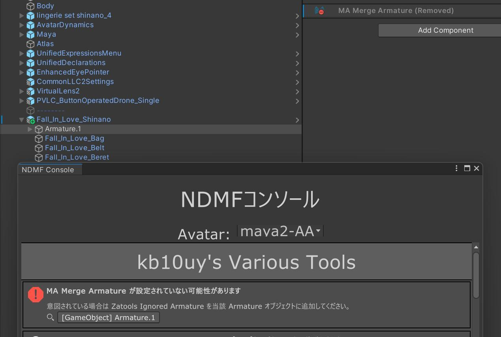

+++
title = 'Avatar Status Validator'
date = 2025-05-22T19:36:30+09:00
+++

収録パッケージ: [kb10uy's Various Tools](https://github.com/kb10uy/kb10uy-zatools) / `org.kb10uy.zatools` (>= 2.2.0-beta.1)

## 概要

アバターのビルド時にいくつかの項目をチェックします。
この機能は kb10uy's Various Tools をインストールした時点で有効になりますが、それ自身がアバターのビルド内容に変更を加えることはありません。

## チェック項目

### Merge Armature 抜けの可能性 (`ScanUnmergedArmature`)

**(>=2.4.0) `Tools > kb10uy's Various Tools > Avatar Status Validator > Scan suspicious unmerged armature` を有効にする必要があります。**

`Armature` など、アバター内でアーマチュアの起点の可能性がある名前の GameObject に [MA Merge Armature](https://modular-avatar.nadena.dev/ja/docs/reference/merge-armature) コンポーネントが追加されていない場合、エラーを出力してアバターのビルドを中止させます。
当該 GameObject に `Zatools Ignored Armature` コンポーネントを追加することで明示的に無視させることが可能です。

(>=2.2.1) Merge Armature か Bone Proxy が上の Armature に追加されている場合も無視されるようになりました。
