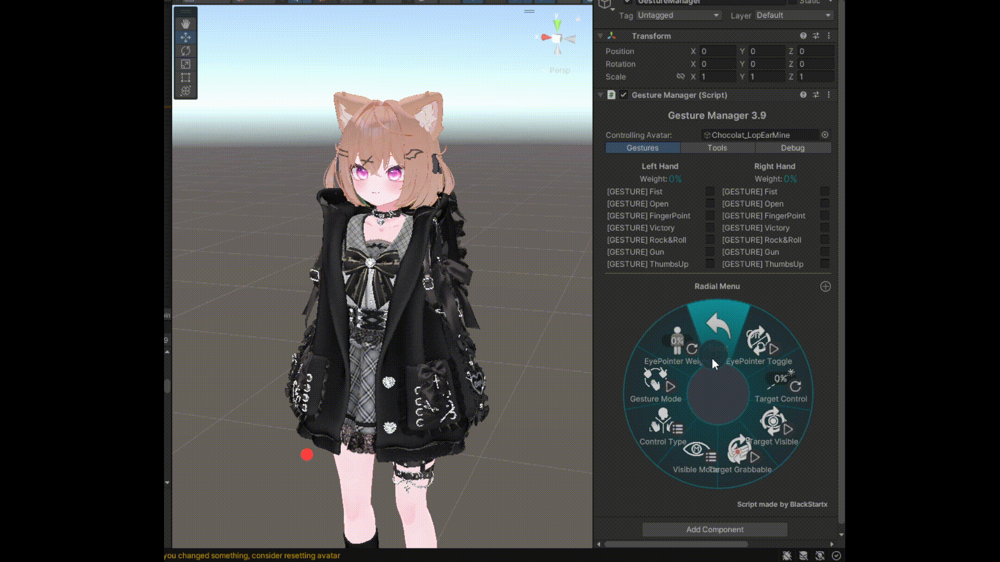

+++
title = "Enhanced EyePointer Installer"
date = 2024-08-27T22:18:25+09:00
images = ["component-initial.png"]
weight = 101
+++

収録パッケージ: [kb10uy's Various Tools](https://github.com/kb10uy/kb10uy-zatools) / `org.kb10uy.zatools` (>= 1.2.1)

**2024-09-03 以降は[Automatic EyePointer Installer](https://github.com/kb10uy/eye-pointer-installer) ではなくこちらをご利用ください。**

(>=3.7.1) 内部実装をリファクタリングし、NDMF/MA のみで全ての処理が完結するようになりました。

## 概要

Siromori 氏の [Eye Pointer](https://booth.pm/ja/items/4742883) のセットアップを自動化するスクリプトです。
Constraint の挿入などをアバターのビルド時に自動で実行します。

## 使い方

Eye Pointer のプレハブをアバターに追加したあと、その GameObject に `Zatools Enhanced EyePointer Installer` を追加します。

* **VRC Constraint を使ってセットアップする**: Unity の Aim Constraint ではなく VRC Aim Constraint を目のボーンに設定します。Eye Pointer が v1.2 以降である必要があります。
* **目にダミーボーンを挿入する**: 元の目のボーンの上に `DummyEye_L/R` を挿入します。元の目のボーンの角度が (0, 0, 0) から大きく離れている場合に有効です。
* **ターゲットの軸を修正する**: (>= 4.0.0) 注目点を操作するための Target オブジェクトの配置を、LowerArm から Hand の方向を用いて修正して配置するようにします。ボーンの向き先方向と Transform の +Y 軸が揃っていないアバターの場合、これを有効にすると操作感が改善します。
* **Global Weightを上書きする** : Aim ConstraintのGlobal Weightを上書きします。Targetを同じ位置に置いた際のEyeboneの操作量を変更したい際に有効です。
    * **Global Weightの操作Puppetを追加する**: EyePointer操作Menuと同じ階層に上書き値を操作できるRadial Puppet Menuを追加します。
      
* **FX Layer をアバターに適応させる**: 後述。通常はオフのままで問題ありません。
* **別のアバター頭部のルート(上級者向け)**: アバタールートの頭部ではなく別アバターの頭部を合成する場合、その別アバターのルートになる GameObject を指定します。通常は無指定で問題ありません。

現状では`VRC Constraint を使ってセットアップする`,`ダミーボーンを挿入する`のチェックボックスを有効にするのをおすすめします。

**v1.4.2 以降Eye Pointer のプレハブの配置場所はアバタールートの直下である必要はありません。** ビルド時に自動でアバタールートの直下に移動されます。

### Eye ボーンの判定方法

以下の順序で判定されます。

1. **Avatar Descriptor の Eye Look が有効な場合**、その設定の *Left Eye* と *Right Eye* を参照します。
2. **Avatar Descriptor の Eye Look が無効な場合**、アバタールートの Animator にセットされている Avatar アセット[^1]に記録されているボーンの対応付けのうち、 Left Eye と Right Eye の値を参照します。
3. いずれにもない場合、Enhanced EyePointer Installer は何もしません。

[^1]: 紛らわしいですが、Humanoid リグの FBX ファイルをインポートした後に Jaw を外したり Force T-pose したりするアレです。

### 標準対応していない構成のアーマチュアについて (>=2.3.0)

Eye Pointer は、配布されている状態では目のボーンに到達するまでのアーマチュアの構成に対応しています(2025-05-25 時点)。
アバター本体のアーマチュアの構成がこれらのパターンに一致しない場合、目のボーンに挿入される Aim Constraint を操作できず正常に動作しない可能性があります。

* `Armature/Hips/Spine/Chest/Neck/Head/LeftEye`
* `Armature/Hips/Spine/Chest/Neck/Head/Left Eye`
* `Armature/Hips/Spine/Chest/Neck/Head/Eye_L`
* `Armature/Hips/Spine/Chest/Neck/Head/Eye.L`
* etc... (他数種類)

**「FX Layer をアバターに適応させる」のオプションを有効にすると、ビルド時にこれらのアニメーションの操作パスを*実際の*アーマチュアに即したものに書き換えます。**
これにより、アーマチュアのボーン名を書き換えることなく(つまり他のギミックなどに極力影響を及ぼさず) Eye Pointer を動作させることができます。
*実際の*目のボーンは上記「Eye ボーンの判定方法」で検出可能である必要があるのでご注意ください。

## その他注意点など

### MA Merge Armature と併用

MA Merge Armature を利用して Unity 上で別アバターの頭部を合成するといった構成では、 **Eye Look の設定には身体側[^2]のボーンを設定する必要があります。**
頭部側の Eye ボーンを設定した場合、Merge Armature によってそのボーンが消滅し上記の参照先の検索に失敗してしまいます。

> Enhanced EyePointer Installer は処理中に Eye ボーンの Transform 値を操作しますが、
> MA の処理の一部でボーンの参照先を修正する[^ma-430]際に Transform 値が操作する前の値に戻ってしまいます[^ma-1036](Unity が悪い)。
> なお現在はボーンの参照先を修正する前の値に再設定する処理が追加されている[^ma-1062]ためこの問題は発生しません。

[^2]: 厳密には Merge Armature で統合先に指定されている、最終的に残る方の Armature に含まれる Eye ボーン

[^ma-430]: [キメラアバターでビルド後Validation時にエラーになることがある。](https://github.com/bdunderscore/modular-avatar/issues/430)
[^ma-1036]: [Avatar にバインドされる Humanoid ボーンの Transform に対する操作が Rebind humanoid avatar パスで破棄される](https://github.com/bdunderscore/modular-avatar/issues/1036)
[^ma-1062]: [Preserve local transform when rebinding humanoid avatar](https://github.com/bdunderscore/modular-avatar/pull/1062)

### AvatarPoseSystem との併用 (>= 4.0.0)

アバター内に [AvatarPoseSystem](https://booth.pm/ja/items/5989814) が設置されていることを検出した場合、自動的に専用の処理が実行されます。
これについて、現時点で以下の制約があります。

* AvatarPoseSystem >= 4.1.0 である必要があります。
* **目にダミーボーンを挿入する** とは併用できません(強制的に無効になります)。
* **ターゲットの軸を修正する** とは併用できます。

{}

[AvatarPoseSystem](https://booth.pm/ja/items/5989814) に EyePointer を導入する際にこのコンポーネントを使用する場合、以下の条件を満たす必要があります。

* AvatarPoseSystem >= 4.1.0
* kb10uy's Various Tools >= 3.1.6

その上で次のように設定してください。記載のない項目については特に制限はありません。

* AvatarPoseSystem
    * Unhandle Eyes: 有効
    * Unfix Objects: 以下のものを設定
        - `EyePointer/WorldAnchor/TargetHead`
        - `EyePointer/WorldAnchor/TargetHand_L`
        - `EyePointer/WorldAnchor/TargetHand_R`
* Enhanced EyePointer Installer
    * VRC Constraint を使ってセットアップする: 有効
    * ダミーボーンを挿入する: 無効
    * FX Layer をアバターに適応させる: 有効

この状態でビルドすると、Enhanced EyePointer Installer が自動的に AvatarPoseSystem を検知して追加の処理を実行します。

{}

## 既知の問題

{}
~~(v1.2.1) EyePointer v1.2 でダミーボーンを挿入するとフルトラキャリブレーション時に Constraint が意図しない挙動をすることが確認されています。また、他のプレイヤーからも同様に正面ではない(無効化されていない)状態で見えることがあります。~~

**上記の現象は Avatar Descriptor の Eye Look の設定に起因します。**
詳しくは[Issue #16 のコメント](https://github.com/kb10uy/kb10uy-zatools/issues/16#issuecomment-2336783558)を参照してください。
v1.4.1 以降はこの場合無意味な GameObject を追加し Eye Look をそれに対して有効化します。
{}
