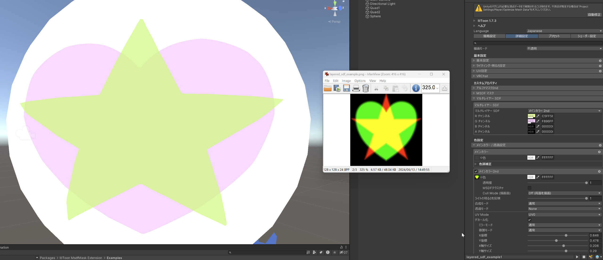

+++
title = 'lilToon MsdfMask Extension'
date = 2024-08-27T22:27:02+09:00
featuredImage = 'custom-properties.png'
+++

収録パッケージ: [lilToon MsdfMask Extension](https://github.com/kb10uy/liltoon-msdfmask) / `org.kb10uy.liltoon-msdfmask`

## 概要

lilToon の[カスタムシェーダー機能](https://lilxyzw.github.io/lilToon/#/ja-jp/dev/custom_shader)を利用して以下の 2 つの機能を追加したものです。

### アルファマスク 2nd

すでに存在するアルファマスク(以下 1st)に上から追加でもう一枚アルファマスクを適用できるものです。
合成モードも 1st と同じく置き換え(これはあんま意味ないか)、乗算、加算、減算をサポートしています。

### MSDF マスクテクスチャ

主要なマスクテクスチャを MSDF として解釈するオプションです。マスクをかけられるかつ MSDF でかける需要がありそうなフィールドについては一通り対応しています。値の反転も可能です。

### マルチレイヤー SDF

メインカラー 2nd(3rd) のテクスチャを R/G/B チャンネルそれぞれ SDF として解釈し、指定した色の塗りつぶしの重ね合わせとして表現できるようにします。

## 使い方

マテリアルのシェーダー選択で `MsdfMask/lilToon` を選択してください。通常の lilToon の設定項目に加えて、以下のようにカスタムプロパティーが表示されます。

### アルファマスク 2nd

基本的には通常の lilToon でカットアウト・半透明に設定した場合に出現するアルファマスクの設定と同じものになります。
**アルファマスク 2nd**の中にあるドロップダウンからアルファマスクの合成モードを選択してください。

通常のアルファマスクと異なり不透明描画モードでも表示されますが、この状態では設定しても特に意味はないので注意してください。

### MSDF テクスチャについて
